# Sistema VetNova - Arquitectura de Microservicios

## 1. Contexto y Arquitectura Aplicada
Este proyecto corresponde al Examen Final Transversal (EFT). Consiste en un sistema de gestión clínica veterinaria construido bajo una **Arquitectura de Microservicios Distribuidos**. 

Para garantizar la escalabilidad y el desacoplamiento, aplicamos los siguientes patrones y decisiones técnicas:
* **Patrón CSR (Controller-Service-Repository):** Separación estricta de responsabilidades en cada microservicio, usando DTOs para no exponer las entidades de base de datos.

* **API Gateway (Single Point of Entry):** Centralización del enrutamiento. Todo el tráfico externo entra por el puerto `9091` y es redirigido dinámicamente mediante configuración YAML.

* **Seguridad Stateless con JWT:** Autenticación descentralizada. `ms-auth` emite los tokens y cada microservicio valida las firmas localmente con una clave compartida (`jwt.secret`), evitando saturar la red.

* **Comunicación Síncrona (WebClient):** Validación de integridad referencial entre dominios (ej. `ms-mascotas` consulta a `ms-duenos` antes de registrar un paciente).

## 2. Ecosistema de Microservicios:

1. `api-gateway` (Puerto 9091): Orquestador y enrutador central.

**David Torrealba:**
2. `ms-auth` (Puerto 8081): Gestor de identidad y seguridad.
3. `ms-duenos` (Puerto 8082): Gestión del dominio de clientes.
4. `ms-mascotas` (Puerto 8083): Gestión del dominio de pacientes clínicos.

**Adriano:**
5. `ms-[nombre]` (Puerto [X]): [Breve descripción de qué hace]
6. `ms-[nombre]` (Puerto [X]): [Breve descripción]
7. `ms-[nombre]` (Puerto [X]): [Breve descripción]

**Diego:**
8. `ms-inventario` - Puerto 8087: Gestión de productos, stock, precio y categoría.
9. `ms-logistica` - Puerto 8088: Gestión de proveedores y solicitudes de reposición.
10. `ms-ecommerce` - Puerto 8089: Publicación y consulta de productos web.
11. `ms-facturacion` - Puerto 9090: Gestión de facturas, cálculo de total y validación de stock.

### Fase 1: Persistencia y Variables de Entorno
1. **Motor de Base de Datos:** Iniciar el servicio de MySQL de forma local (puerto por defecto `3306`).
2. **Configuración de Credenciales:** En el IDE (VS Code / IntelliJ), abrir el archivo `application.yml` de cada microservicio y verificar que las propiedades `spring.datasource.username` y `spring.datasource.password` coincidan con las credenciales locales.
3. **Clave de Seguridad:** Validar que la propiedad `jwt.secret` tenga exactamente el mismo valor en `ms-auth`, para asegurar la correcta validación de las firmas de los tokens.

### Fase 2: Ejecución y Orquestación de Servicios
Debido a las dependencias internas y la validación de integridad referencial, el ecosistema debe levantarse en el siguiente orden estricto (utilizando el botón "Run" del IDE o el comando `./mvnw spring-boot:run` en la terminal):

* **Paso 1 (Identidad):** Levantar `ms-auth` (Puerto 8081).
* **Paso 2 (Dominio Base):** Levantar `ms-duenos` (Puerto 8082). *Es requisito previo para Mascotas.*
* **Paso 3 (Dominio Dependiente):** Levantar `ms-mascotas` (Puerto 8083).

* **Paso 4 (Servicios Adicionales):** Levantar los microservicios correspondientes a Adriano y Diego.

* **Paso 5 (Perímetro):** Levantar `api-gateway` (Puerto 9091). *Debe ser el último en iniciar para mapear correctamente las rutas de los servicios ya activos.*

### Fase 3: Validación (Smoke Test)
Una vez que todas las consolas muestren el estado `STARTED`, realizar una petición POST a la ruta del Gateway `http://localhost:9091/api/auth/login` con credenciales válidas para confirmar que el enrutamiento y la red interna están operativos.

## 4. Evidencias y Pruebas de Calidad (QA)

### 4.1. David Torrealba ( Auth, Dueños y Mascotas)
* **Swagger auth:** `http://localhost:8081/swagger-ui.html`
* **Swagger Dueños:** `http://localhost:8082/swagger-ui.html`
* **Swagger Mascotas:** `http://localhost:8083/swagger-ui.html`

**A. Flujo Core y Seguridad (Vía Gateway)**

## Ms-Auth
## Generación de Token por Gateway

## autorización con swagger

## Pruebas

## ms-Dueno

## Creación de dueno CON TOKEN 

## Creación dueno sin token

## Pruebas 

## Ms-Mascota

## Creación de mascota sin id existente

## Creación de mascota con id existente

## pruebas

---

### 4.2. Parte de Adriano
* **Swagger:** `http://localhost:[PUERTO]/swagger-ui.html`

**A. Pruebas de Integración**
*(Adriano: Pega aquí 2 pantallazos de Postman probando la creación/búsqueda en tus microservicios a través del puerto 9091 del Gateway).*

**B. Cobertura de Pruebas Unitarias (>80%)**
*(Adriano: Pega aquí tu pantallazo demostrando que tus test unitarios superan el 80% de cobertura).*

---

### 4.3. Parte de Diego Torres

Microservicios desarrollados:
- `ms-inventario` - Puerto 8087
- `ms-logistica` - Puerto 8088
- `ms-ecommerce` - Puerto 8089
- `ms-facturacion` - Puerto 9090

Swagger/OpenAPI:
- Inventario: `http://localhost:8087/swagger-ui.html`
- Logística: `http://localhost:8088/swagger-ui.html`
- Ecommerce: `http://localhost:8089/swagger-ui.html`
- Facturación: `http://localhost:9090/swagger-ui.html`

#### Arquitectura aplicada

Los microservicios fueron desarrollados con Spring Boot siguiendo el patrón CSR:

- Controller: expone los endpoints REST.
- Service: contiene la lógica de negocio.
- Repository: gestiona el acceso a datos mediante JPA.
- DTOs: permiten transportar información entre capas y entre microservicios.
- WebClient: permite consumir información remota desde otros microservicios.
- Swagger/OpenAPI: documenta los endpoints.
- JUnit, Mockito y MockMvc: se utilizaron para pruebas unitarias.
- JWT: protege rutas mediante token.
- API Gateway: centraliza el acceso desde el puerto 9091.

#### Flujo de negocio de los microservicios de Diego

El flujo operativo se apoya principalmente en `ms-inventario`. Primero se gestionan productos y stock. Luego `ms-logistica` permite registrar proveedores y solicitudes de reposición. `ms-ecommerce` publica productos provenientes de inventario en el catálogo web. Finalmente, `ms-facturacion` valida productos y stock antes de registrar una factura.

Rutas principales mediante API Gateway:

| Funcionalidad | Ruta Gateway | Microservicio destino |
|---|---|---|
| Listar productos | `/productos` | ms-inventario |
| Listar proveedores | `/proveedores` | ms-logistica |
| Listar solicitudes | `/solicitudes-reposicion` | ms-logistica |
| Listar productos web | `/productos-web` | ms-ecommerce |
| Listar facturas | `/facturas` | ms-facturacion |

#### Evidencias Postman mediante API Gateway
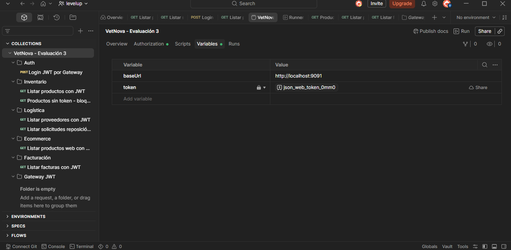
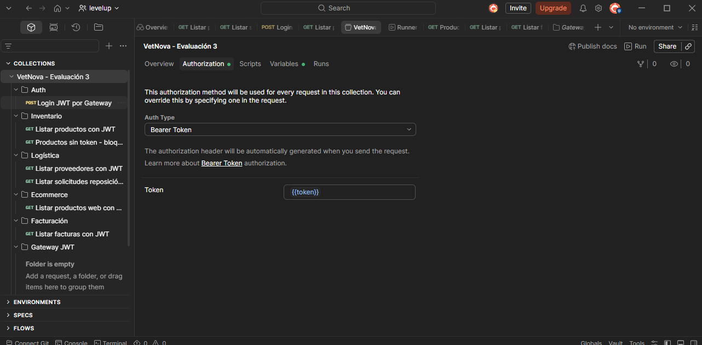
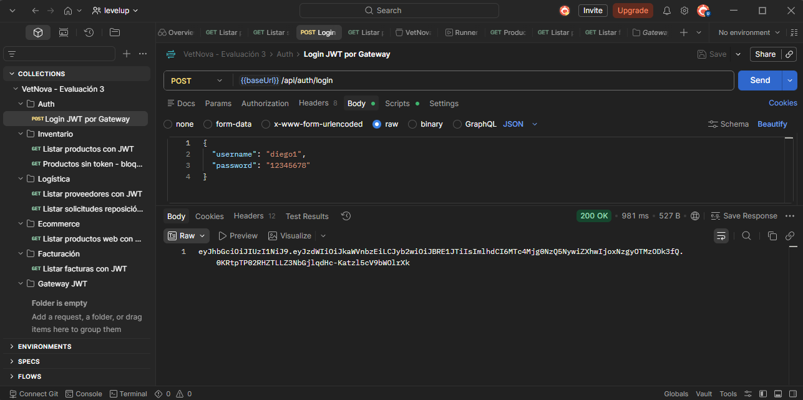
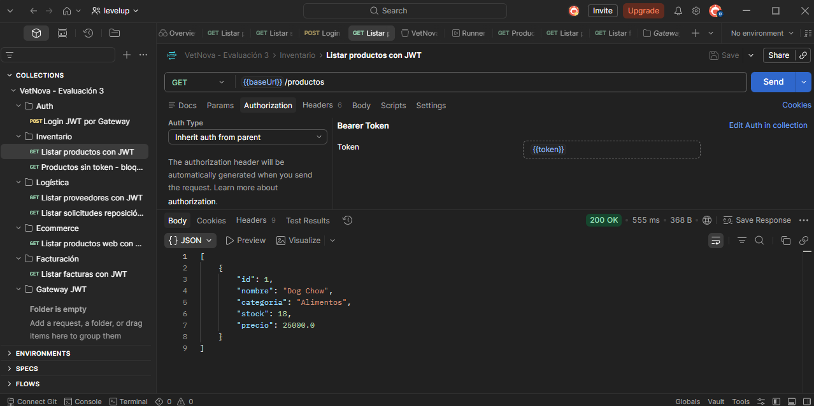
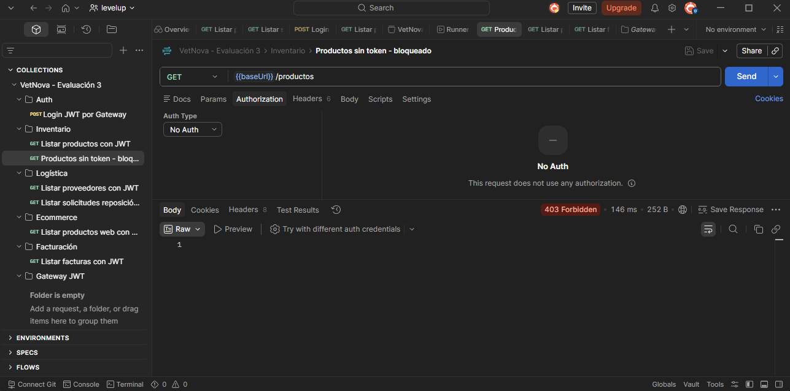
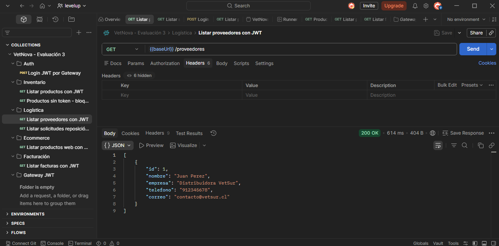
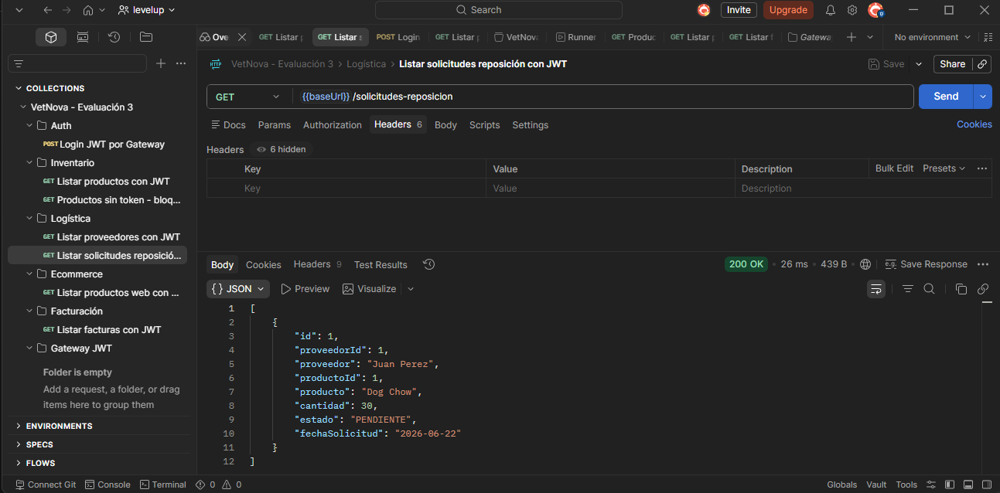
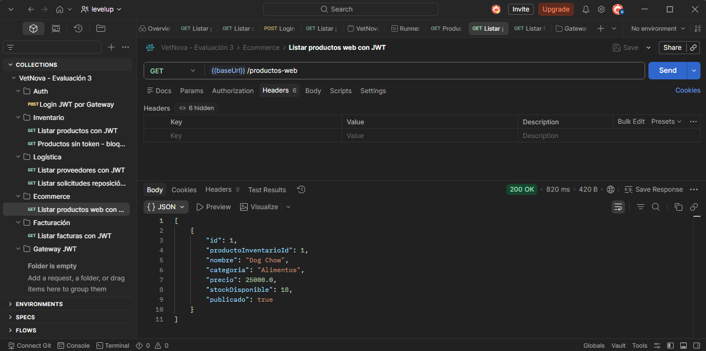
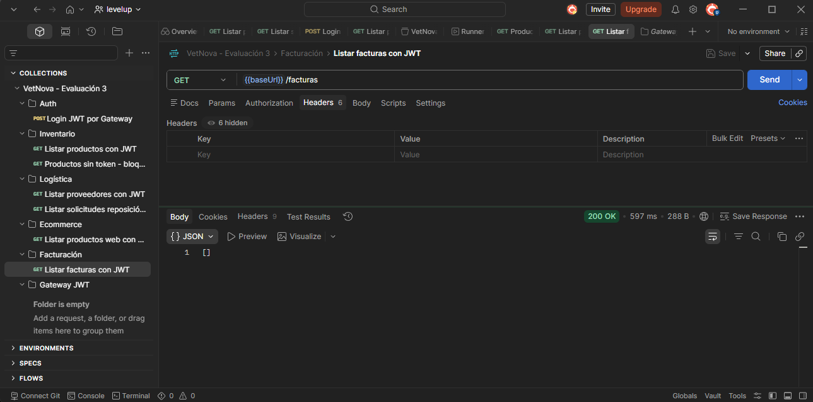

#### Evidencias Swagger/OpenAPI

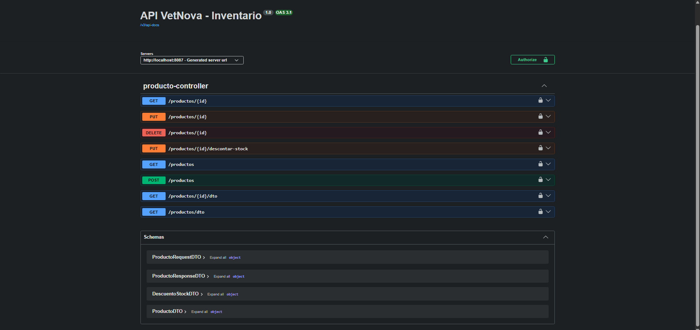
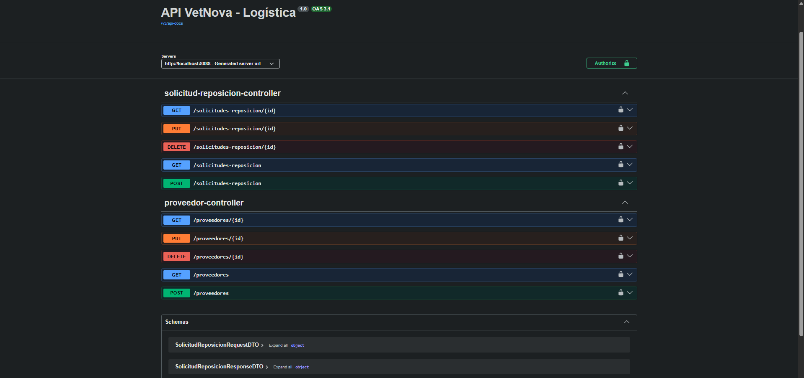
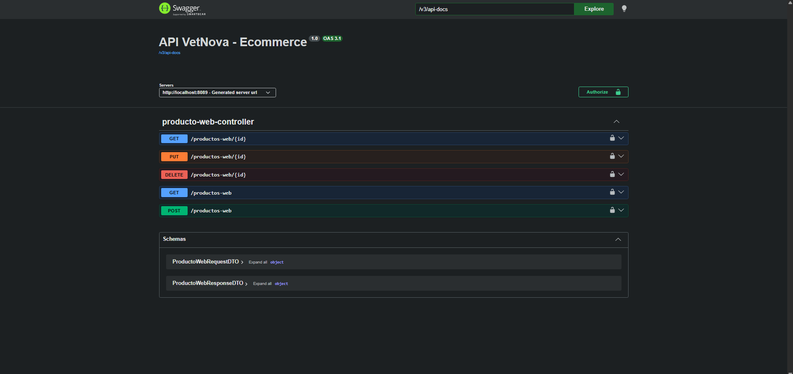
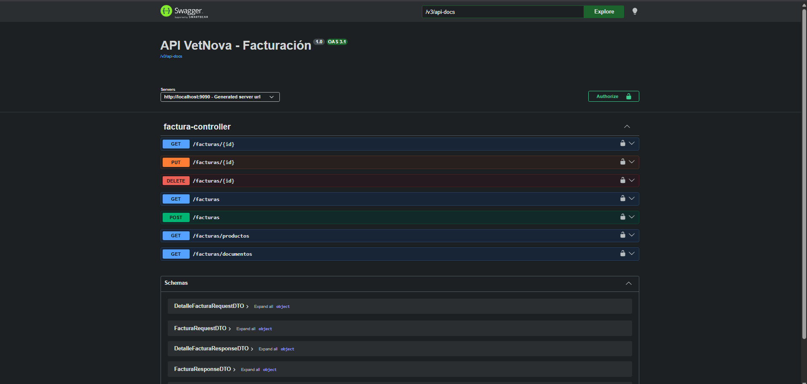

#### Evidencias de pruebas unitarias

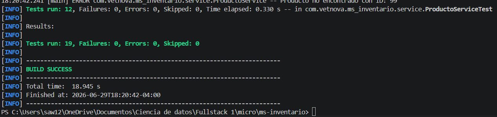
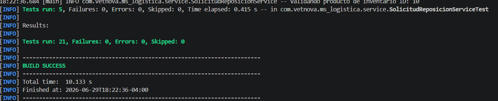
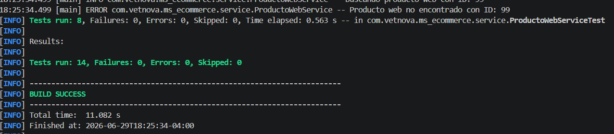
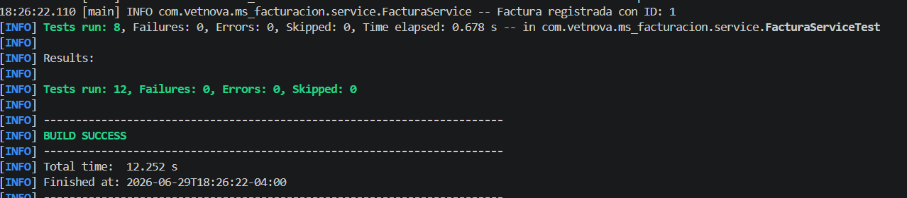